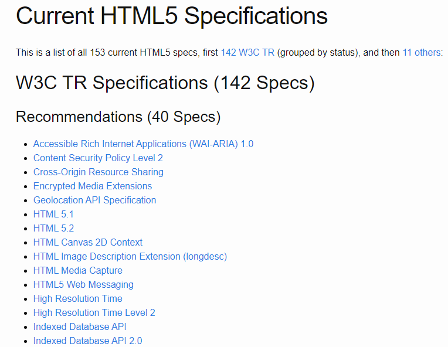
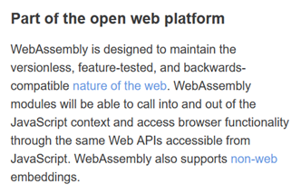
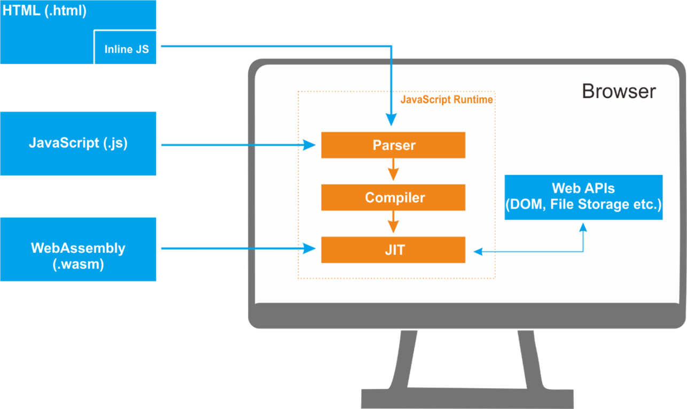

# The Web Development Course


# Table of Contents


- [x] What is Open Web Platform?
  - [x] Technical Specification
  - [x] HTML 5.2
    - [x] Semantic Advantage
    - [x] Connectivity Advantage
    - [x] Storage Advantage
    - [x] Multimedia Advantage
    - [x] Performance Advantage
    - [x] Device Access Advantage
    - [x] Specification
  - [x] Web Assembly
    - [x] Safe
    - [x] Fast
    - [ ] Portable Code
    - [ ] Compact Code
    - [ ] Specification
  - [ ] EcmaScript
    - [ ] Specification
  - [ ] WebSocket
    - [ ] Specification
    - [ ] Application
  - [ ] WebRTC
    - [ ] Specification
    - [ ] Application
  - [ ] WebGL
    - [ ] Specification
    - [ ] Application


---


# Open Web Platform

> *The web platform is Write Once, Cry Everywhere.*
>
> *— Yehuda Katz*

Web technology is very broad and interesting to learn, almost every day many new things are born there. Utilization of web technology has become a daily necessity, almost every profit and non-profit line of business is now using web technology that has been standardized by OWP.

But what is OWP? To be honest, of all the books on web programming that the author has read, none of them have written about OWP. Whereas OWP is the basic information that we must know first before getting to know the web world.

OWP stands for Open Web Platform, in which there is a collection of technologies developed with the concept of Open Standards by the W3C (World Wide Web Consortium) and other standards-setting organizations (Standards Setting Organization or SSO) such as WHATWG (The Web Hypertext Application Technology Working Group), Unicode Consortium, IETF (Internet Engineering Task Force), and Ecma International.

The term Open Web Platform itself was introduced by the W3C and in 2011 the CEO of W3C, Jeff Jaffe explained that:

> “OWP is a platform for innovation, consolidation and price efficiency.”


---

## Technical Specification

Each technology has a Specification, please note 

> "Specification is not a user manual", 

The purpose of the specification is the goal used to explain to programmers who is implementing the technology and what features must be there and how to implement it.

We will learn the collection of technologies in the Open Web Platform most of them are computer languages and APIs within the scope of web technologies.


---


## HTML 5.2


HTML (hypertext markup language) is a markup language for creating web documents that can be displayed by a web browser. HTML was developed by WHATWG a group of people who care about web technology, currently HTML development has reached version 5.2.

HTML 5.2 introduces semantic concepts and a set of APIs for building complex web applications. HTML 5.2 is designed to be adaptable to desktop and mobile devices because all browser engines in modern browsers already support HTML 5.2.


### Semantic Advantage

From the Semantic side there are new HTML Elements for interacting with multimedia and graphic content such as :

```html
<video> 
<audio> 
<canvas> 
```

and support for the SVG API and MathML API for displaying mathematical formulas in web documents.


### Connectivity Advantage

In terms of connectivity, there is a WebSocket API for fast full duplex communication between the server and client, the Server Sent Event (SSE) API so that the server can push events to the client and the WebRTC API for real-time communication technology to perform videoconferencing in the browser without the need to use additional plugin. 


### Storage Advantage

From the Storage side, there is a Web Storage API to store data in the browser with a key/value format. Consists of localStorage and sessionStorage. Then there is the IndexedDB API for storing large amounts of data, searching for data using the IndexedDB API is very fast because it uses indexing. There is also an API to detect whether the user's browser is online or offline (connected to the internet) and File API support to access files in our operating system.


### Multimedia Advantage

From the Multimedia side there is support for the Camera API, and WebVTT for creating subtitles and chapters. In addition there is a Canvas API for painting objects, support for WebGL to interact with 3D objects and an SVG API.


### Performance Advantage

In terms of performance, we have used a javascript engine that supports JIT compilation, there is a Web Worker if we want to empower threads, there is an XMLHTTPRequest Level 2 for fetching asynchronously using AJAX, there is a History API that can be used to manipulate history in the browser, there is Drag & Drop API for manipulating elements, Fullscreen API for a better user experience in watching shows.


### Device Access Advantage

From the Device Access side there is support such as Geolocation which allows the browser to access the user's location, there is a Touch Event that can be used to detect screen touches, there is a Device Orientation Detection that can read the screen position in portrait or landscape, and the Pointer lock API to lock the pointer on an object within some content on the web.


### Specification

The specifications are at:

https://html.spec.whatwg.org/multipage/

HTML 5 has grown into a collection of browser technologies that can enable web developers to develop complex web applications. Most of the HTML 5 specifications are made by the W3C Technical Report (TR) document, but there are also specifications that are not made by the W3C (non-W3C Technical Report (TR)).

At the time of writing there are 153 active specifications being developed in HTML 5 technology:

http://html5-overview.net/current




---


## Web Assembly

Web Assembly is one of the latest technology from the Open Web Platform developed by the W3C. We can clearly see this statement on the official assembly web site:



Initially designed so that applications written in programming languages such as C/C++ & Rust can run in modern browsers. C/C++ & Rust languages will be compiled to produce Web Assembly, the magnitude speed of web assembly is faster than javascript.

Technically, Web Assembly uses a javascript engine that can mimic a virtual machine to read binary instruction formats in a stack-based-machine style.

The impact of Web Assembly innovation is powerful for the development on heavy applications in many domains such as Computer Vision, 3D Processing, WebVR, & Image Processing can be achieved with great performance speeds. The Speed of Web Assembly near native code execution.

Web Assembly is an abstraction for modern hardware, which makes it a platform-independent computer language. 

Web assembly has several advantages:


### Safe 

The availability of a managed language that implements memory safety by preventing programs from accessing or manipulating user data and systems.


### Fast 

Able to produce native code that has been optimized so that it can optimally utilize all the performance capabilities of the computer machine.


### Portable Code 

It is platform-independent, running on all modern browsers and computer architectures.


### Compact Code 

Can be sent over lightweight networks to reduce time, save bandwidth and be responsive.




### Specification

Specifications in:

http://webassembly.github.io/spec/core/