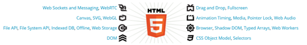

# The Web Development Course

# Table of Contents

- [x] What is Open Web Platform?
  - [x] Technical Specification
  - [ ] HTML 5.2
    - [ ] Semantic Advantage
    - [ ] Connectivity Advantage
    - [ ] Storage Advantage
    - [ ] Multimedia Advantage
    - [ ] Performance Advantage
    - [ ] Device Access Advantage
    - [ ] Specification
  - [ ] Web Assembly
    - [ ] Safe
    - [ ] Fast
    - [ ] Portable Code
    - [ ] Compact Code
    - [ ] Specification
  - [ ] EcmaScript
    - [ ] Specification
  - [ ] WebSocket
    - [ ] Specification
    - [ ] Application
  - [ ] WebRTC
    - [ ] Specification
    - [ ] Application
  - [ ] WebGL
    - [ ] Specification
    - [ ] Application

---

# Open Web Platform

> *The web platform is Write Once, Cry Everywhere.*
>
> *— Yehuda Katz*

Web technology is very broad and interesting to learn, almost every day many new things are born there. Utilization of web technology has become a daily necessity, almost every profit and non-profit line of business is now using web technology that has been standardized by OWP.

But what is OWP? To be honest, of all the books on web programming that the author has read, none of them have written about OWP. Whereas OWP is the basic information that we must know first before getting to know the web world.

OWP stands for Open Web Platform, in which there is a collection of technologies developed with the concept of Open Standards by the W3C (World Wide Web Consortium) and other standards-setting organizations (Standards Setting Organization or SSO) such as WHATWG (The Web Hypertext Application Technology Working Group), Unicode Consortium, IETF (Internet Engineering Task Force), and Ecma International.

The term Open Web Platform itself was introduced by the W3C and in 2011 the CEO of W3C, Jeff Jaffe explained that:

> “OWP is a platform for innovation, consolidation and price efficiency.”

---

## Technical Specification

Each technology has a Specification, please note 

> "Specification is not a user manual", 

The purpose of the specification is the goal used to explain to programmers who is implementing the technology and what features must be there and how to implement it.

We will learn the collection of technologies in the Open Web Platform most of them are computer languages and APIs within the scope of web technologies.

---

## HTML 5.2

HTML (hypertext markup language) is a markup language for creating web documents that can be displayed by a web browser. HTML was developed by WHATWG a group of people who care about web technology, currently HTML development has reached version 5.2.

HTML 5.2 introduces semantic concepts and a set of APIs for building complex web applications. HTML 5.2 is designed to be adaptable to desktop and mobile devices because all browser engines in modern browsers already support HTML 5.2.

### Semantic Advantage

From the Semantic side there are new HTML Elements for interacting with multimedia and graphic content such as <video>, <audio>, <canvas> and support for the SVG API and MathML API for displaying mathematical formulas in web documents.